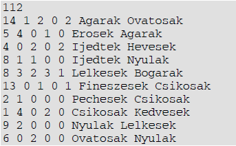
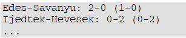
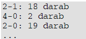

# 4. Foci

Perec város sportéletében fontos szerepet játszanak a fiatalok nagypályás labdarúgó mérkőzései. Tavasszal minden csapat minden csapattal pontosan egy mérkőzést játszott. A folyamatosan vezetett eredménylista azonban eltűnt, így csak a mérkőzések jegyzőkönyvei álltak rendelkezésre. A jegyzőkönyveket ismételten feldolgozták, ehhez első lépésként a meccs.txt állományba bejegyeztek néhány adatot. Önnek ezzel az állománnyal kell dolgoznia.

A meccs.txt állomány első sorában az állományban tárolt mérkőzések száma található. Alatta minden sorban egy-egy mérkőzés adatai olvashatók. Egy mérkőzést 7 adat ír le. Az első megadja, hogy a mérkőzést melyik fordulóban játszották le. A második a hazai, a harma- dik a vendégcsapat góljainak száma a mérkőzés végén, a negyedik és ötödik a félidőben elért gólokat jelöli. A hatodik szöveg a hazai csapat neve, a hetedik a vendégcsapat neve. Az egyes adatokat egyetlen szóköz választja el egymástól. A sor végén nincs szóköz. A csapatok és a fordulók száma nem haladja meg a 20, a mérkőzések száma pedig a 400 értéket. Egy csapat sem rúgott meccsenként 9 gólnál többet. A csapatok neve legfeljebb 20 karakter hosszú, a névben nincs szóköz.

Például:

Az 2. sor mutatja, hogy a 14. fordulóban az otthon játszó Agarakat az Óvatosak 2-1-re megverték úgy, hogy a félidőben már vezettek 2-0-ra.

Készítsen programot, amely az alábbi kérdésekre válaszol! A program forráskódját mentse foci néven! (A program megírásakor a felhasználó által megadott adatok helyességét, érvé- nyességét nem kell ellenőriznie.)

A képernyőre írást igénylő részfeladatok eredményének megjelenítése előtt írja a képer- nyőre a feladat sorszámát (például: 3. feladat:). Ha a felhasználótól kér be adatot, jelenítse meg a képernyőn, hogy milyen értéket vár!

1. Olvassa be a meccs.txt állományban talált adatokat, s annak felhasználásával oldja meg a következő feladatokat! Ha az állományt nem tudja beolvasni, az első 10 mérkőzés adata- it jegyezze be a programba és dolgozzon azzal!
2. Kérje be a felhasználótól egy forduló számát, majd írja a képernyőre a bekért forduló mérkőzéseinek adatait a következő formában: Edes-Savanyu: 2-0 (1-0)! Soronként egy mérkőzést tüntessen fel! A különböző sorokban a csapatnevek ugyanazon a pozíción kezdődjenek!

Például:

1. Határozza meg, hogy a bajnokság során mely csapatoknak sikerült megfordítaniuk az ál- lást a második félidőben! Ez azt jelenti, hogy a csapat az első félidőben vesztésre állt ugyan, de sikerült a mérkőzést megnyernie. A képernyőn soronként tüntesse fel a forduló sorszámát és a győztes csapat nevét!
2. Kérje be a felhasználótól egy csapat nevét, és tárolja el! A következő két feladat megoldá- sához ezt a csapatnevet használja! Ha nem tudta beolvasni, használja a Lelkesek csapatne- vet!
3. Határozza meg, majd írja ki, hogy az adott csapat összesen hány gólt lőtt és hány gólt ka- pott! Például: lőtt: 23 kapott: 12
4. Határozza meg, hogy az adott csapat otthon melyik fordulóban kapott ki először és melyik csapattól! Ha egyszer sem kapott ki (ilyen csapat például a Bogarak), akkor „A csapat otthon veretlen maradt." szöveget írja a képernyőre!
5. Készítsen statisztikát, amely megadja, hogy az egyes végeredmények hány alkalommal fordultak elő! Tekintse egyezőnek a fordított eredményeket (például 4-2 és 2-4)! A na- gyobb számot mindig előre írja! Az elkészült listát a stat.txt állományban helyezze el!

Például:

[def]: image1.png