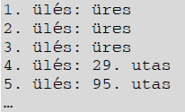

# 4. Helyjegy

Egy autóbuszokat üzemeltető társaság távolsági járataira az utasok jobb kiszolgálása érdekében csak akkor ad el jegyet, ha ülőhelyet is tud biztosítani. Minden jegyre rányomtatja, hogy az adott vonalon mettől meddig érvényes és melyik ülést lehet elfoglalni birtokában.

Az eladott.txt állomány pontosan egy út jegyvásárlásait tartalmazza. Az első sorban az eladott jegyek száma (legfeljebb 500), a vonal hossza (legfeljebb 200 km) és minden megkezdett 10 km után fizetendő összeg (legfeljebb 100 Ft) található.

Az állomány további sorai – a vásárlás sorrendjében – egy-egy jegy három adatát írják le: az utas melyik ülést foglalhatja el, hol száll fel és hol száll le. (A fel- és a leszállás helyét a járat kezdőállomásától mért távolsággal adják meg.) Az üléseket 1-től 48-ig folyamatosan számozták. A soron belüli határoló jel minden esetben egy-egy szóköz. Az állomány csak egész számokat tartalmaz.

Az utast a későbbiekben egyetlen sorszámmal azonosítjuk, azzal az értékkel, amely megadja, hogy hanyadik jegyvásárló volt.

A jegy árának meghatározásakor az értéket öttel osztható számra kell kerekítenie. (1, 2, 6 és 7 esetén lefelé, 3, 4, 8 és 9 esetén pedig felfelé kell kerekítenie.)

Például:

eladott.txt

Az adott járat 200 km hosszú úton közlekedik. Eddig 132 jegyet adtak el, és megkezdett 10 km-ként 71 Ft-ba kerül a jegy. Az állomány harmadik sora tartalmazza a második jegyvásárló adatait, aki a 13. és a 65. km között utazik a 12. helyen ülve. A megtett távolság 52 km, tehát 6 darab 10 km hosszú szakaszért kell fizetnie, ennek értéke 6\*71, azaz 426 Ft. Mivel kerekíteni kell, ezért a fizetendő összeg 425 Ft.

Készítsen programot, amely az alábbi kérdésekre válaszol! A program forráskódját helyjegy néven mentse!

Minden – képernyőre írást igénylő – részfeladat megoldása előtt írja a képernyőre a feladat sorszámát! Ha a felhasználótól kér be adatot, jelenítse meg a képernyőn, hogy milyen értéket vár (például a 7. feladat esetén: „7. feladat Adja meg, hogy az út mely kilométerén kéri az utaslistát!")! Az ékezetmentes kiírás is elfogadott.

1. Olvassa be az eladott.txt állományban talált adatokat, s azok felhasználásával oldja meg a következő feladatokat! Ha az állományt nem tudja beolvasni, az állomány első 10 sorának adatait jegyezze be a programba és dolgozzon azzal!
2. Adja meg a legutolsó jegyvásárló ülésének sorszámát és az általa beutazott távolságot! A kívánt adatokat a képernyőn jelenítse meg!
3. Listázza ki, kik utazták végig a teljes utat! Az utasok sorszámát egy-egy szóközzel elválasztva írja a képernyőre!
4. Határozza meg, hogy a jegyekből mennyi bevétele származott a társaságnak! Az eredményt írja a képernyőre!
5. Írja a képernyőre, hogy a busz végállomást megelőző utolsó megállásánál hányan szálltak fel és le!
6. Adja meg, hogy hány helyen állt meg a busz a kiinduló állomás és a célállomás között! Az eredményt írja a képernyőre!
7. Készítsen „utaslistát" az út egy pontjáról! A listában ülésenként tüntesse fel, hogy azt az adott pillanatban melyik utas foglalja el! A pontot, azaz a kiindulási állomástól mért távolságot, a felhasználótól kérje be! Ha a beolvasott helyen éppen megálló lett volna, akkor a felszálló utasokat vegye figyelembe, a leszállókat pedig hagyja figyelmen kívül! Az eredményt az ülések sorszámának sorrendjében írja a kihol.txt állományba! Az üres helyek esetén az „üres" szót jelenítse meg! Minden ülés külön sorba kerüljön!

Például kihol.txt:

