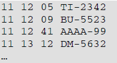

# Közúti ellenőrzés

Bizonyára mindenki látott már rendőrjárőrt, aki szolgálata során egy út menti ellenőrző pontról a forgalmat figyelte. A járőr feladata lehet a szabálytalankodók kiszűrése mellett az elhaladó járművek szúrópróbaszerű vagy módszeres ellenőrzése. Bizonyos esetekben egy műszaki ellenőrző állomás is kitelepül, amely alkalmas a kiválasztott járművek műszaki állapotának felmérésére.

Egy olyan nap adatait kell feldolgoznia, amelyen a rendőri mellett műszaki ellenőrzés is zajlott egy egyirányú út mentén. Az úton haladó legalább 50, de legfeljebb 1000 jármű adatait a jarmu.txt állományban tárolta el a rendőrautó forgalomrögzítő kamerájához csatlakoztatott gép. Az állomány sorai azonos szerkezetűek, az időt és a rendszámot tartalmazzák az elhaladás sorrendjében. A rendszám mindig 7 karakter hosszú, az angol ábécé nagybetűit, kötőjelet és számjegyeket tartalmaz ebben a sorrendben. A példában szereplőtől eltérő felépítésű rendszámok is lehetségesek.

Például:

A 2. sor mutatja, hogy a BU-5523 jármű 11 óra 12 perc 9 másodperckor haladt át az ellenőrző ponton.

Készítsen programot, amely az alábbi kérdésekre válaszol! A program forráskódját mentse jaror néven! (A program megírásakor a felhasználó által megadott adatok helyességét, érvényességét nem kell ellenőriznie.)

A képernyőre írást igénylő részfeladatok eredményének megjelenítése előtt írja a képernyőre a feladat sorszámát (például: 3. feladat:)! Ha a felhasználótól kér be adatot, jelenítse meg a képernyőn, hogy milyen értéket vár! Az ékezetmentes kiírás is elfogadott.

1. Olvassa be a jarmu.txt állományban talált adatokat, s annak felhasználásával oldja meg a következő feladatokat!
2. Határozza meg, hogy aznap legalább hány óra hosszat dolgoztak az ellenőrzést végzők, ha munkaidejük egész órakor kezdődik, és pontosan egész órakor végződik! (Minden óra 0 perc 0 másodperckor kezdődik, és 59 perc 59 másodperccel végződik.) Az eredményt jelenítse meg a képernyőn!
3. Műszaki ellenőrzésre minden órában egy járművet választanak ki. Azt, amelyik abban az órában először halad arra. Az ellenőrzés óráját és az ellenőrzött jármű rendszámát jelenítse meg a képernyőn a következő formában: 9 óra: AB-1234! Minden óra adata külön sorba kerüljön! Csak azon órák adatai jelenjenek meg, amikor volt ellenőrizhető jármű!
4. A rendszám első karaktere külön jelentéssel bír. Az egyes betűk közül a „B" autóbuszt, a „K" kamiont, az „M" motort jelöl, a többi rendszámhoz személygépkocsi tartozik. Jelenítse meg a képernyőn, hogy az egyes kategóriákból hány jármű haladt el az ellenőrző pont előtt!
5. Mettől meddig tartott a leghosszabb forgalommentes időszak? A választ jelenítse meg a képernyőn a következő formában: 9:9:13 - 9:15:3!
6. A rendőrök egy baleset közelében látott járművet keresnek rendszám alapján. A szemtanúk csak a rendszám bizonyos karaktereire emlékeztek, így a rendszám ismeretlen karaktereit a \* karakterrel helyettesítve keresik a nyilvántartásban. Kérjen be a felhasználótól egy ilyen rendszámot, majd jelenítse meg a képernyőn az arra illeszthető rendszámokat!
7. Egy közúti ellenőrzés pontosan 5 percig tart. Amíg az ellenőrzés folyik, a járművek szabadon elhaladhatnak, a következő megállítására csak az ellenőrzés befejezése után kerül sor. Ha a rendőrök a legelső járművet ellenőrizték, akkor mely járműveket tudták ellenőrizni a szolgálat végéig? Írja az ellenőrzött járművek áthaladási idejét és rendszámát a vizsgalt.txt állományba az áthaladás sorrendjében, a bemenettel egyező formában! Ügyeljen arra, hogy az időadatokhoz tartozó számok a bevezető nullákat tartalmazzák!