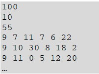

# 4. Lift

A Madárház Kft. toronyházak építésével foglalkozik. Jelenleg a Csúcs Rt. 100 szintes szerkezetkész épületén kezdték meg a belső szerelési műveleteket. Az egyes szerelőcsapatok naponta többször változtatják helyüket. Ha az új munkaterület egy másik emeleten van, akkor – a biztonsági előírások miatt – lifttel kell menniük. A házban egyetlen lift működik, amelynek igénybevételét az egyes csapatok a célszint megadásával jelezhetik. A lift az igényeket a jelzés sorrendjében szolgálja ki, és egyszerre csak egy csapatot szállít. A csapatok mozgását a 9 és 14 óra közötti intervallumban követjük nyomon. Ez az intervallum a munkaidőnek csak egy része, tehát a csapatok már dolgoznak valamelyik szinten, de 9 órakor teljesítetlen kérés nincs és a lift szabad.

A lifthasználati igényeket az igeny.txt állomány tartalmazza. Első sorában a szintek száma (legfeljebb 100), a második sorban a csapatok száma (legfeljebb 50), a harmadik sorban pedig az igények száma (legfeljebb 100) olvasható. A negyedik sortól kezdve soronként egy-egy igény szerepel a jelzés sorrendjében. Egy igény hat számból áll: az első három szám az időt adja meg (óra, perc, másodpercszám sorrendben), a negyedik a csapat sorszáma, az ötödik az induló-, a hatodik a célszint sorszáma. Az egyes számokat pontosan egy szóköz választja el egymástól.

Például igeny.txt:

A 4. sor megmutatja, hogy 9 óra 7 perc 11 másodperckor a 7. csapat igényelt liftet, hogy a 6. szintről a 22. szintre eljusson.

Készítsen programot, amely az alábbi kérdésekre válaszol! A program forráskódját lift néven mentse! Ügyeljen arra, hogy programjának minden helyes tartalmú bemeneti állomány esetén működnie kell!

Minden részfeladat megoldása előtt írja a képernyőre a feladat sorszámát! Ha a felhasználótól kér be adatot, jelenítse meg a képernyőn, hogy milyen értéket vár (például a 2. feladat esetén: „2. feladat Kérem a lift indulási helyét!")! A képernyőn megjelenített üzenetek esetén az ékezetmentes kiírás is elfogadott.

1. Olvassa be az igeny.txt állományban talált adatokat, s azok felhasználásával oldja meg a következő feladatokat! Ha az állományt nem tudja beolvasni, az első 8 igényhez tartozó adatokat jegyezze be a programba és dolgozzon azzal!
2. Tudjuk, hogy a megfigyelés kezdetén a lift éppen áll. Kérje be a felhasználótól, hogy melyik szinten áll a lift, és a további részfeladatok megoldásánál ezt vegye figyelembe! Ha a beolvasást nem tudja elvégezni, használja az igény.txt fájlban az első igény induló szintjét!
3. Határozza meg, hogy melyik szinten áll majd a lift az utolsó kérés teljesítését követően! Írja képernyőre a választ a következőhöz hasonló formában: „A lift a 33. szinten áll az utolsó igény teljesítése után." !
4. Írja a képernyőre, hogy a megfigyelés kezdete és az utolsó igény teljesítése között melyik volt a legalacsonyabb és melyik a legmagasabb sorszámú szint, amelyet a lift érintett!
5. Határozza meg, hogy hányszor kellett a liftnek felfelé indulnia utassal és hányszor utas nélkül! Az eredményt jelenítse meg a képernyőn!
6. Határozza meg, hogy mely szerelőcsapatok nem vették igénybe a liftet a vizsgált intervallumban! A szerelőcsapatok sorszámát egymástól egy-egy szóközzel elválasztva írja a kép- ernyőre!
7. Előfordul, hogy egyik vagy másik szerelőcsapat áthágja a szabályokat, és egyik szintről gyalog megy a másikra. (Ezt onnan tudhatjuk, hogy más emeleten igényli a liftet, mint ahova korábban érkezett.) Generáljon véletlenszerűen egy létező csapatsorszámot! (Ha nem jár sikerrel, dolgozzon a 3. csapattal!) Határozza meg, hogy a vizsgált időszak igényei alapján lehet-e egyértelműen bizonyítani, hogy ez a csapat vétett a szabályok ellen! Ha igen, akkor adja meg, hogy melyik két szint közötti utat tették meg gyalog, ellenkező esetben írja ki a Nem bizonyítható szabálytalanság szöveget!
8. A munkák elvégzésének adminisztrálásához minden csapatnak egy blokkoló kártyát kell használnia. A kártyára a liftben elhelyezett blokkolóóra rögzíti az emeletet, az időpontot. Ennek a készüléknek a segítségével kell megadni a munka kódszámát és az adott munkafolyamat sikerességét. A munka kódja 1 és 99 közötti egész szám lehet. A sikerességet a „befejezett" és a „befejezetlen" szavakkal lehet jelezni.

Egy műszaki hiba folytán az előző feladatban vizsgált csapat kártyájára az általunk nyomon követett időszakban nem került bejegyzés. Ezért a csapatfőnöknek a műszak végén pótolnia kell a hiányzó adatokat. Az igeny.txt állomány adatait felhasználva írja a kép- ernyőre időrendben, hogy a vizsgált időszakban milyen kérdéseket tett fel az óra, és kérje be az adott válaszokat a felhasználótól! A pótlólag feljegyzett adatokat írja a blokkol.txt állományba! A blokkol.txt állomány tartalmát az alábbi sorok mintájára alakítsa ki:

