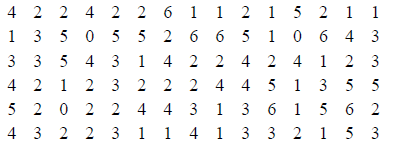

# 4. Lottó

Magyarországon 1957 óta lehet ötös lottót játszani. A játék lényege a következő: a lottószelvényeken 90 szám közül 5 számot kell a fogadónak megjelölnie. Ha ezek közül 2 vagy annál több megegyezik a kisorsolt számokkal, akkor nyer. Az évek során egyre többen hódoltak ennek a szerencsejátéknak és a nyeremények is egyre nőttek.

Adottak a lottosz.dat szöveges állományban a 2003. év 51 hetének ötös lottó számai. Az első sorában az első héten húzott számok vannak, szóközzel elválasztva, a második sorban a második hét lottószámai vannak stb.

Például:

A lottószámok minden sorban emelkedő számsorrendben szerepelnek.

Az állományból kimaradtak az 52. hét lottószámai. Ezek a következők voltak: 89 24 34 11 64. Készítsen programot a következő feladatok megoldására!

1. Kérje be a felhasználótól az 52. hét megadott lottószámait!
2. A program rendezze a bekért lottószámokat emelkedő sorrendbe! A rendezett számokat írja ki a képernyőre!
3. Kérjen be a felhasználótól egy egész számot 1-51 között! A bekért adatot nem kell ellenőrizni!
4. Írja ki a képernyőre a bekért számnak megfelelő sorszámú hét lottószámait, a lottosz.dat állományban lévő adatok alapján!
5. A lottosz.dat állományból beolvasott adatok alapján döntse el, hogy volt-e olyan szám, amit egyszer sem húztak ki az 51 hét alatt! A döntés eredményét (Van/Nincs) írja ki a képernyőre!
6. A lottosz.dat állományban lévő adatok alapján állapítsa meg, hogy hányszor volt páratlan szám a kihúzott lottószámok között! Az eredményt a képernyőre írja ki!
7. Fűzze hozzá a lottosz.dat állományból beolvasott lottószámok után a felhasználótól bekért, és rendezett 52. hét lottószámait, majd írja ki az összes lottószámot a lotto52.ki szöveges fájlba! A fájlban egy sorba egy hét lottószámai kerüljenek, szóközzel elválasztva egymástól!
8. Határozza meg a lotto52.ki állomány adatai alapján, hogy az egyes számokat hányszor húzták ki 2003-ban. Az eredményt írja ki a képernyőre a következő formában: az első sor első eleme az a szám legyen ahányszor az egyest kihúzták! Az első sor második eleme az az érték legyen, ahányszor a kettes számot kihúzták stb.! (Annyit biztosan tudunk az értékekről, hogy mindegyikük egyjegyű.)

Példa egy lehetséges eredmény elrendezésére (6 sorban, soronként 15 érték).

1. Adja meg, hogy az 1-90 közötti prímszámokból melyiket nem húzták ki egyszer sem az elmúlt évben. A feladat megoldása során az itt megadott prímszámokat felhasználhatja vagy előállíthatja! (2, 3, 5, 7, 11, 13, 17, 19, 23, 29, 31, 37, 41, 43, 47, 53, 59, 61, 67, 71, 73, 79, 83, 89.)