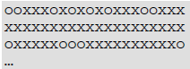
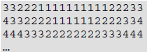
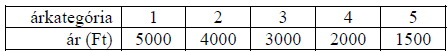
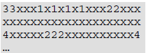

# 4. Nézőtér

A Fregoli Színházban a jegyeladásokat elektronikusan rögzítik. A színházban 15 sor, és soronként 20 szék van. A sorokat 1-től 15-ig számozzák, a sorokon belül pedig a székeket 1-től 20-ig. Egy előadásra a pillanatnyilag eladott jegyek eloszlását a foglaltsag.txt szöveges állomány tartalmazza, melyben „x" jelzi a foglalt és „o" a szabad helyeket.

Például:

Az első sor 1-2. széke például még szabad, míg a 2. sorba az összes jegyet eladták.

A jegyek ára nem egyforma, összege a helytől függően ötféle lehet. Azt, hogy az adott szék az öt közül melyik árkategóriába tartozik, a kategoria.txt fájl tartalmazza az alábbi formában:

Például:

A példa szerint az 1. sor 2. széke a 3. kategóriába, a 2. sor 1. széke a 4. kategóriába esik.

Készítsen programot nezoter néven a következő feladatok megoldására! A program futása során a képernyőre való kiíráskor, illetve az adatok billentyűzetről való beolvasásakor utaljon a feladat sorszámára (például: 3. feladat), és a kiírandó, illetve bekérendő tartalomra! Az ékezetmentes kiírás is elfogadott.

1. Olvassa be és tárolja el a foglaltsag.txt és a kategoria.txt fájl adatait!
2. Kérje be a felhasználótól egy sor, és azon belül egy szék számát, majd írassa ki a képernyőre, hogy az adott hely még szabad-e vagy már foglalt!
3. Határozza meg, hogy hány jegyet adtak el eddig, és ez a nézőtér befogadóképességének hány százaléka! A százalékértéket kerekítse egészre, és az eredményt a következő formában írassa ki a képernyőre:

Például:

Az előadásra eddig 156 jegyet adtak el, ez a nézőtér 42%-a.

4. Határozza meg, hogy melyik árkategóriában adták el a legtöbb jegyet! Az eredményt írassa ki a képernyőre az alábbi formában:

Például:

A legtöbb jegyet a(z) 3. árkategóriában értékesítették.

5. A jegyek árát kategóriánként a következő táblázat tartalmazza:

Mennyi lenne a színház bevétele a pillanatnyilag eladott jegyek alapján? Írassa ki az eredményt a képernyőre!

1. Mivel az emberek általában nem egyedül mennek színházba, ha egy üres hely mellett nincs egy másik üres hely is, akkor azt nehezebben lehet értékesíteni. Határozza meg, és írassa ki a képernyőre, hogy hány ilyen „egyedülálló" üres hely van a nézőtéren!
2. A színház elektronikus eladási rendszere az érdeklődőknek az üres helyek esetén a hely árkategóriáját jeleníti meg, míg a foglalt helyeket csak egy „x" karakterrel jelzi. Készítse el ennek megfelelően a fenti adatokat tartalmazó szabad.txt fájlt!

Például:

