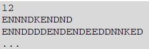

# 4. Robot

Gáborék iskolai szakkörön robotot építenek. Már elkészítettek egy olyan változatot, ame- lyik sík terepen kellő pontossággal vezérelhető. A robot a memóriájába előre betáplált prog- ramok egyikét hajtja végre. A robot jelenleg csak az E, K, D, N utasításokat érti, amelyek a négy égtáj (sorrendben: észak, kelet, dél, nyugat) irányában tett 1 centiméteres elmozdulást eredményezik.

A robotba táplált programokat a program.txt állományban rögzítettük. Az állomány első sorában a betáplált programok száma található, amely legfeljebb 100. Alatta soronként egy-egy program olvasható. Egy sor legfeljebb 200 karakter hosszúságú, benne az E, K, D, N karakterek mint utasítások találhatók. A sorok nem tartalmaznak szóközt.

Például program.txt:

A 2. sorban az első betáplált program utasításai vannak.

Készítsen programot, amely az alábbi kérdésekre válaszol! A program forráskódját robot

néven mentse!

Minden részfeladat megoldása előtt írja a képernyőre a feladat sorszámát! Ha a felhaszná- lótól kér be adatot, jelenítse meg a képernyőn, hogy milyen értéket vár (például 2. feladat: Kérem az utasítássor sorszámát!)!

1. Olvassa be a program.txt állományban talált adatokat, s azok felhasználásával oldja meg a következő feladatokat! Ha az állományt nem tudja beolvasni, az állomány első 10 sorának adatait jegyezze be a programba és dolgozzon azzal!
2. Kérje be egy utasítássor számát, majd írja a képernyőre, hogy:
  - Egyszerűsíthető-e az utasítássorozat! Az egyszerűsíthető, illetve nem egyszerű- síthető választ írja a képernyőre! (Egy utasítássort egyszerűsíthetőnek nevezünk, ha van benne két szomszédos, ellentétes irányt kifejező utasításpár, hiszen ezek a párok elhagyhatók. Ilyen ellentétes utasításpár az ED, DE, KN, NK.)
  - Az utasítássor végrehajtását követően legkevesebb mennyi E vagy D és K vagy N uta- sítással lehetne a robotot a kiindulási pontba visszajuttatni! A választ a következő formában jelenítse meg: 3 lépést kell tenni az ED, 4 lépést a KN tengely mentén.
  - Annak végrehajtása során hányadik lépést követően került (légvonalban) legtávolabb a robot a kiindulási ponttól és mekkora volt ez a távolság! A távolságot a lépés sorszá- mát követően 3 tizedes pontossággal írja a képernyőre!
3. A robot a mozgáshoz szükséges energiát egy beépített akkuból nyeri. A robot 1 centiméternyi távolság megtételéhez 1 egység, az irányváltásokhoz és az induláshoz 2 egység energiát használ. Ennek alapján az EKK utasítássor végrehajtásához 7 egység energia szükséges. A szakkörön használt teljesen feltöltött kis kapacitású akkuból 100, a nagykapacitásúból 1000 egységnyi energia nyerhető ki. Adja meg azon utasítássorokat, amelyek végrehajtásához a teljesen feltöltött kis kapacitású akku is elegendő! Írja a képer- nyőre egymástól szóközzel elválasztva az utasítássor sorszámát és a szükséges energia mennyiségét! Minden érintett utasítássor külön sorba kerüljön!
4. Gáborék továbbfejlesztették az utasításokat értelmező programot. Az új, jelenleg még tesztelés alatt álló változatban a több, változatlan irányban tett elmozdulást helyettesítjük az adott irányban tett elmozdulások számával és az irány betűjével. Tehát például a DDDKDD utasítássor leírható rövidített 3DK2D formában is. Az önállóan álló utasításnál az 1-es számot nem szabad kiírni! Hozza létre az ujprog.txt állományt, amely a program.txt állományban foglalt utasítássorozatokat az új formára alakítja úgy, hogy az egymást követő azonos utasításokat minden esetben a rövidített alakra cseréli! Az ujprog.txt állományba soronként egy utasítássor kerüljön, a sorok ne tartalmazzanak szóközt!
5. Sajnos a tesztek rámutattak arra, hogy a program új verziója még nem tökéletes, ezért vissza kell térni az utasítássorok leírásának régebbi változatához. Mivel a szakkörösök na- gyon bíztak az új változatban, ezért néhány utasítássort már csak ennek megfelelően ké- szítettek el. Segítsen ezeket visszaírni az eredeti formára! Az ismétlődések száma legfel- jebb 200 lehet! Kérjen be egy új formátumú utasítássort, majd írja a képernyőre régi for- mában!