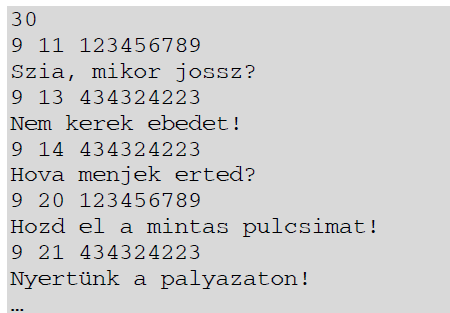

# 4. SMS küldő
Esemes Ernő szenvedélyes SMS-küldő, ezért a MaMobil nevű cég tesztelésre kérte fel. Ehhez egy új, kézreálló telefont adnak, amelynek tesztüzemben egyetlen hátránya, hogy legfeljebb az először érkező 10 darab, egyenként legfeljebb 100 karakteres üzenetet tud eltárolni. Ha ettől több üzenet van, akkor azokat korlátlan számban a szolgáltató őrzi meg a hangpostához hasonlóan, tehát azokhoz csak bizonyos díj fejében juthat hozzá. Az üzenetek nem tartalmazhatnak ékezetes karaktereket.

Az sms.txt állomány első sorában az a k szám olvasható, amely megadja, hogy hány üzenet érkezett a készülékre a mai napon. Az érkező üzenetek száma legalább egy, de nem haladja meg a 100 darabot. Minden üzenethez 2 sor tartozik. Az első sor szerkezete a következő: először az érkezés órája (szám), érkezés perce (szám), telefonszám (pontosan 9 jegyű szám), a másodikban pedig az üzenet (legfeljebb 100 karakternyi szöveg) található. Az állományban az üzenetek számát követően k×2 sor szerepel. Az üzenetek érkezési idő szerint növekvően rendezettek.

Például:

Készítsen programot sms néven, amely az alábbi kérdésekre válaszol! Ügyeljen arra, hogy a program forráskódját a megadott helyre mentse!

A képernyőre írást igénylő részfeladatok eredményének megjelenítése előtt írja a képernyőre a feladat sorszámát! (Például 3. feladat)

1. Olvassa be az sms.txt állományban talált adatokat, s annak felhasználásával oldja meg a következő feladatokat! Ha az állományt nem tudja beolvasni, akkor a benne található adatok közül az első tíz üzenet adatait jegyezze be a programba, s úgy oldja meg a feladatokat!
2. A fájlban tárolt utolsó üzenet érkezésekor melyik üzenet a legfrissebb a telefon memóriájában? Írja az üzenet szövegét a képernyőre!
3. Adja meg a leghosszabb és a legrövidebb üzenetek adatait! Ha több azonos hosszúságú üzenet van, akkor elegendő csak egyet-egyet megadnia! A képernyőn óra, perc, telefonszám, üzenet formában jelenítse meg az adatokat!
4. Készítsen karakterhossz szerinti statisztikát: 1-20, 21-40, 41-60, 61-80, 81-100! Az intervallumok mellé a hozzájuk tartozó üzenetek darabszámát írja, mint eredményt a képernyőre!
5. Ha Ernő minden óra 0. percében elolvasná a memóriában lévő üzeneteket (az éppen ekkor érkező üzeneteket nem látja), majd ki is törölné, akkor hány olyan üzenet lenne, amelynek elolvasásához fel kellene hívnia a szolgáltatót? Írja ezt a számot a képernyőre! (Az üzeneteket először 1, utoljára 24 órakor olvassa el.)
6. Ernő barátnője gyakran küld sms-t az 123456789-es számról. Mennyi volt a leghosszabb idő, amennyi eltelt két üzenete között? Ha legfeljebb 1 üzenet érkezett tőle, akkor írja ki, hogy „nincs elegendő üzenet", egyébként pedig adja meg a leghosszabb időtartamot óra perc alakban!
7. Egy üzenet véletlenül késett. Olvassa be a billentyűzetről ennek az sms-nek az adatait, majd tárolja el a memóriában a többihez hasonlóan!
8. Az smski.txt állományban készítsen egy listát az üzenetekről telefonszám szerinti csoportosításban, telefonszám szerint növekvő sorrendben! Egy csoporthoz tartozó első sorban a feladó telefonszáma szerepeljen! Az alatta lévő sorokban a feladás ideje, majd a tőle újabb szóközzel elválasztva az üzenet szövege szerepeljen!