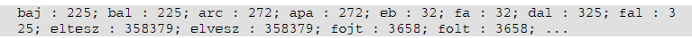

# SMS szavak
Napjainkban a kommunikáció egy elterjedt formája az SMS-küldés. Az SMS-küldésre alkalmas telefonok prediktív szövegbevitellel segítik az üzenetek megírását. Ennek használatakor a szavakat úgy tudjuk beírni, hogy a telefon számbillentyűjén található betűknek megfelelő számokat kell beírnunk. A számok és betűk megfeleltetését az alábbi táblázat mutatja:

Ha meg szeretnénk jeleníteni az „ablak" szót, akkor a 22525 kódot kell beírnunk. A telefon a tárolt szótára alapján a kódhoz kikeresi a megfelelő szót. Ha több szóhoz is azonos kód tartozik, akkor a kódhoz tartozó összes szót felkínálja választásra. Egy ilyen szógyűjteményt talál a szavak.txt fájlban. A fájlról a következőket tudjuk:

- Legfeljebb 600 szó található benne.
- Minden szó külön sorban található.
- A szavak hossza maximum 15 karakter.
- A szavak mindegyike csak az angol ábécé kisbetűit tartalmazza.
- Minden szó legfeljebb egyszer szerepel.

Írjon sms néven programot, ami a szógyűjtemény felhasználásával megoldja az alábbi feladatokat!

1. Kérjen be a felhasználótól egy betűt, és adja meg, hogy milyen kód (szám) tartozik hozzá! Az eredményt írassa a képernyőre!
2. Kérjen be a felhasználótól egy szót, és határozza meg, hogy milyen számsorral lehet ezt a telefonba bevinni! Az eredményt írassa a képernyőre!
3. Olvassa be a szavak.txt fájlból a szavakat, és a továbbiakban azokkal dolgozzon! Ha nem tudja az állományból beolvasni az adatokat, akkor az állományban található „b" kezdőbetűs szavakat gépelje be a programba, és azokkal oldja meg a feladatokat!
4. Határozza meg és írassa a képernyőre, hogy melyik a leghosszabb tárolt szó! Amennyiben több azonos hosszúságú van, elegendő csak az egyiket megjeleníteni. Adja meg ennek a szónak a hosszát is!
5. Határozza meg és írassa a képernyőre, hogy hány rövid szó található a fájlban! Rövid szónak tekintjük a legfeljebb 5 karakterből álló szavakat.
6. Írassa a kodok.txt állományba a szavak.txt fájlban található szavaknak megfelelő számkódokat! Minden szónak feleljen meg egy számkód, és minden számkód külön sorba kerüljön!
7. Kérjen be a felhasználótól egy számsort, és határozza meg, hogy melyik szó tartozhat hozzá! Amennyiben több szó is megfelelő, akkor mindegyiket írassa ki! (Teszteléshez használhatja például a 225 számsort, mivel ehhez egynél több szó tartozik a szógyűjteményben.)
8. Határozza meg, hogy a szógyűjteményben mely kódokhoz tartozik több szó is! Írassa ki a képernyőre ezeket a szavakat a kódjukkal együtt egymás mellé az alábbi mintának megfelelően (a szavak sorrendje ettől eltérhet):

9. Határozza meg, hogy melyik kódnak megfelelő szóból van a legtöbb! Írassa ki a képernyőre a kódot, és a kódhoz tartozó összes tárolt szót! Ha több kódhoz is azonos számú szó tartozik, akkor elegendő ezen kódok közül csak az egyikkel foglalkozni.