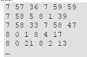
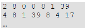
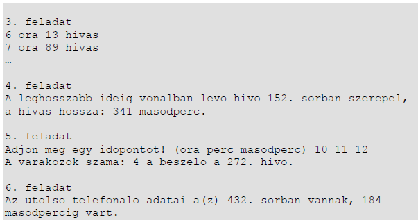

# Telefonos ügyfélszolgálat
Egy kis cég ügyfélszolgálata 8 és 12 óra között várja az érdeklődőket. Egyszerre egy hívást tudnak fogadni. A hívások végén azonnal bekapcsolják a következő hívást.

A hívások irányítását egy automata végzi. Nyitáskor és később is – amint a munkatárs szabaddá válik – a legrégebben várakozót kapcsolja be. A munkaidőben érkező hívások esetén

– ha a hívónak várnia kell – közli vele a várakozók számát. Munkaidőn kívül érkező hívás esetén az automata a legközelebbi időpontot jelzi az ügyfélnek, aki akár vonalban is maradhat addig. A munkatársnak az összes, a munkaidő vége előtt beérkezett hívást fogadnia kell – tehát a 12:00:00-kor érkezőt már nem –, még akkor is, ha a bekapcsolásukra már a munkaidő befejezése után kerül sor.

A hívások adatait (a kapcsolat létrehozásának és a vonal bontásának időpontját) a hivas.txt fájl tárolja a híváskezdés időpontjának sorrendjében. Minden sor két időpontot tartalmaz óra, perc, másodperc formában. A hat számot pontosan egy szóköz választja el egymástól. A sorok száma legfeljebb 1000. Az adatok egy napra vonatkoznak, munkaidőn kívüli értékeket is tartalmazhatnak, minden hívás ezen a napon kezdődött, és be is fejeződött a nap végéig. Feltételezheti, hogy van – legalább két – munkaidőbe eső hívás is. A hívót – a könnyebb kezelhetőség érdekében – a feladatban az időadat sorszámával azonosítjuk.

Például:

A példában egy fájl első 5 sora látható. Ebben az esetben a 2. sor azt mutatja, hogy a hívás a munkaidő kezdete előtt érkezett, de a hívó kivárta, hogy az ügyfélszolgálatos fogadja a hívást. Beszélgetésük 8:0:0-kor kezdődött és 8:1:39-ig tartott, tehát pontosan 99 másodpercig. A 4. hívó megvárta, míg a 2. hívó befejezi, ő 8:1:39-től 8:4:17-ig beszélt az ügyfélszolgálatossal. Az 5. hívóval az automata azt közölte, hogy vele együtt 2 várakozó hívás van. Ő nem várta meg, hogy rá kerüljön a sor.

Látható, hogy egy hívó akkor tudott az ügyfélszolgálatossal beszélni, ha a hívását 12 óra előtt kezdte, valamint 8 óra után, és az összes korábbi hívás végénél később fejezte be.

Készítsen programot, amely a hivas.txt állomány adatait felhasználva az alábbi kérdésekre válaszol! A program forráskódját mentse telefon néven! (A program megírásakor a felhasználó által megadott adatok helyességét, érvényességét nem kell ellenőriznie, feltételezheti, hogy a rendelkezésre álló adatok a leírtaknak megfelelnek.)

A képernyőre írást igénylő részfeladatok eredményének megjelenítése előtt írja a képernyőre a feladat sorszámát (például: 3. feladat:)! Ha a felhasználótól kér be adatot, jelenítse meg a képernyőn, hogy milyen értéket vár! Az ékezetmentes kiírás is elfogadott.

1. Készítse el az mpbe függvényt, amely az óra, perc, másodperc alakban megadott időpont másodpercben kifejezett értékét adja! A függvényt a megoldásba be kell építenie!

`Függvény mpbe(o, p, mp:egész szám):egész szám`

2. Olvassa be a hivas.txt állományban talált adatokat, s annak felhasználásával oldja meg a következő feladatokat!
3. Készítsen statisztikát, amely megadja, hogy óránként hány hívás futott be! A képernyőn soronként egy óra-darabszám párost jelenítsen meg! Csak azok az órák jelenjenek meg, amelyben volt hívás!
4. Írja a képernyőre a leghosszabb hívásnak a sorszámát és másodpercben kifejezett hosszát – attól függetlenül, hogy a hívó tudott-e beszélni az ügyfélszolgálatossal vagy sem! Azonos híváshossz esetén elegendő egyet megjelenítenie.
5. Olvasson be egy munkaidőn belüli időpontot, majd jelenítse meg a képernyőn, hogy hányadik hívóval beszélt akkor az alkalmazott, és éppen hányan vártak arra, hogy sorra kerüljenek! Ha nem volt hívó, akkor a „Nem volt beszélő." üzenetet jelenítse meg!
6. Írja a képernyőre, annak a hívónak az azonosítóját, akivel a munkatárs utoljára beszélt! Írja ki a várakozás másodpercekben mért hosszát is! (Ha nem kellett várnia, a várakozási idő 0.)
7. Készítse el a sikeres.txt állományt, amely az ügyfélszolgálathoz bekapcsolt hívások listáját tartalmazza! A fájl egyes soraiban a hívó sorszáma, a beszélgetés kezdete (amikor az ügyfélszolgálatos fogadta a hívást) és vége szerepeljen az alábbi mintának megfelelő formában! Például a feladat elején olvasható példa bemenet esetén a fájl tartalma:

Példa a szöveges kimenetek kialakításához:

