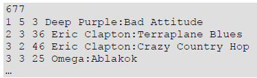

# 4. Zenei adók
A rádióhallgatás ma már egyre inkább zene vagy hírek hallgatására korlátozódik. Ez a fel- adat három, folyamatosan zenét sugárzó adóról szól, azok egyetlen napi műsorát feldolgozva. A reklám elkerülése érdekében az adókat nevük helyett egyetlen számmal azonosítottuk.

A musor.txt állomány első sorában az olvasható, hogy hány zeneszám (z\<=1000) szólt aznap a rádiókban, majd ezt z darab sor követi. Minden sor négy, egymástól egyetlen szóközzel elválasztott adatot tartalmaz: a rádió sorszámát, amit a szám hossza követ két egész szám (perc és másodperc) formában, majd a játszott szám azonosítója szerepel, ami a szám előadójából és címéből áll. A rádió sorszáma az 1, 2, 3 számok egyike. Az adás minden adón 0 óra 0 perckor kezdődik. Egyik szám sem hosszabb 30 percnél, tehát a perc értéke legfeljebb 30, a másodperc pedig legfeljebb 59 lehet. A szám azonosítója legfeljebb 50 karakter hosszú, benne legfeljebb egy kettőspont szerepel, ami az előadó és a cím között található. A számok az elhangzás sorrendjében szerepelnek az állományban, tehát a később kezdődő szám későbbi sorban található. Az állományban minden zeneszám legfeljebb egyszer szerepel.

Például:

Készítsen programot zene néven, amely az alábbi kérdésekre válaszol! Ügyeljen arra, hogy a program forráskódját a megadott helyre mentse!

A képernyőre írást igénylő részfeladatok eredményének megjelenítése előtt írja a képernyőre a feladat sorszámát (például: 3. feladat:). Ha a billentyűzetről olvas be adatot, jelenítse meg a képernyőn, hogy milyen értéket vár.

Az adatszerkezet készítése során vegye figyelembe az Ön által használt programozási kör- nyezetben az adatok tárfoglalási igényét!

1. Olvassa be a musor.txt állományban talált adatokat, s annak felhasználásával oldja meg a következő feladatokat! Ha az állományt nem tudja beolvasni, akkor a forrás első 10 sorának adatait jegyezze be a programba, s úgy oldja meg a következő feladatokat!
2. Írja a képernyőre, hogy melyik csatornán hány számot lehetett meghallgatni!
3. Adja meg, mennyi idő telt el az első Eric Clapton szám kezdete és az utolsó Eric Clapton szám vége között az 1. adón! Az eredményt óra:perc:másodperc formában írja a képernyőre!
4. Amikor az „Omega:Legenda" című száma elkezdődött, Eszter rögtön csatornát váltott. Írja a képernyőre, hogy a szám melyik adón volt hallható, és azt, hogy a másik két adón milyen számok szóltak ekkor. Mivel a számok a kezdés időpontja szerint növekvő sor- rendben vannak, így a másik két adón már elkezdődött a számok lejátszása. Feltételezheti, hogy a másik két adón volt még adás.
5. Az egyik rádióműsorban sms-ben, telefonon, de akár képeslapon is kérhető szám. Ám a sokszor csak odafirkált kéréseket olykor nehéz kibetűzni. Előfordul, hogy csak ennyi olvasható: „gaoaf", tehát ezek a betűk biztosan szerepelnek, mégpedig pontosan ebben a sorrendben. Annyi biztos, hogy először a szerző neve szerepel, majd utána a szám címe. Olvassa be a billentyűzetről a felismert karaktereket, majd írja a keres.txt állományba azokat a számokat, amelyek ennek a feltételnek megfelelnek. Az állomány első sorába a beolvasott karaktersorozat, majd utána soronként egy zeneszám azonosítója kerüljön! A feladat megoldása során ne különböztesse meg a kis- és a nagybetűket!
6. Az 1. adón változik a műsor szerkezete: minden számot egy rövid, egyperces bevezető előz majd meg, és műsorkezdéstől minden egész órakor 3 perces híreket mondanak. Természetesen minden szám egy részletben hangzik el továbbra is, közvetlenül a bevezető perc után. Így ha egy szám nem fejeződne be a hírekig, el sem kezdik, az üres időt a mű- sorvezető tölti ki. Írja a képernyőre óra:perc:másodperc formában, hogy mikor lenne vége az adásnak az új műsorszerkezetben!